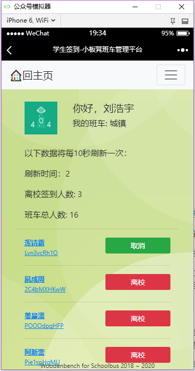

# 班车小板凳

* WOODENBENCH FOR SCHOOLBUS

## 跨平台应用程序 - 项目报告

* CROSS-PLATFORM APPLICATION PROJECT REPORT

# 项目简介

## 为什么会有小板凳

- 班车安全是学校一直以来十分重视的问题，因此学校制定了多项规则，包括上车签名，下车家长签名等方式保证学生已经上车，并且其已经有家长确认到家。 

但是在这过程中产生了一系列的问题，比如：

1. 班车如果迟到或晚到，老师会在家长群里通知，但是部分家长由于设置了静音或免打扰并未收到消息，导致不必要的等待时间；
2. 学生上班车时如果人很多，会在班车门口或车上造成较长时间拥挤，这有可能会引发一些安全问题，包括意外的坠物，踩踏，或者拥挤伤人事件，这都是家长，学校和同学不想看到的。
3. 同理，家长在车下等待签字时，班车有可能简单的停靠在路边，如果长时间在路边占用，会引起部分安全问题。由于路面交通状况不稳定，外加大多数班车到站时间处于晚高峰期，傍晚天色昏暗，有可能会引发安全问题。
4. 根据经验，部分班车会在返校时出现堵车，修路，绕路等突发状况。这导致班车不能及时到达学校，但部分班车老师无法及时联系相应班主任，引起不必要的误会，不利于班主任的科学管理。

因此：小板凳平台将在一定程度上缓解甚至解决以上问题，其主要功能是在线管理学生，班车，并在出现问题时及时通知到相应班主任，本项目基于微信，可以用过微信消息等方式进行消息推送。使用方便，并且开放源代码，可以供老师和同学学习，研究。

## 为什么叫小板凳

本项目基于微信，使用微信作为其主要使用平台。并同时与微信深度集成，可以被叫做"平台"。

但因其代码规模远不及目前市场上的"应用平台"，故名为小板凳，意为"小平台"。

# 项目基础架构

## 开发框架

本项目在微信Web管理界面的后端提供程序使用了.Net Core，其版本号会随时更新。 Web前端界面使用HTML5，CSS3标准保证了大多数浏览器的兼容性。

数据库使用 SQL Server。

本项目在微信的Web管理界面使用了```JQuery & BootStrap```作为前端交互和前端UI，使用了部分微信提供的API。

## Application Insights - 遥测数据和分析

本项目开发目的为提升学生在乘坐班车时的体验，减短家长，学生及老师的等待时间，以此避免可能出现的意外情况。为此，本应用程序使用了微软公司提供的 ```Azure Application Insights``` 服务来监控应用程序在使用时出现的异常，并及时向开发者通知以进行必要的更改，所以在使用中会收集部分技术信息，详见用户隐私数据章节。


## 最终用户许可协议和免责协议

有关最终用户许可协议和免责协议，请阅读程序根目录的EULA.md文件。

# 应用程序功能和操作说明

## 主菜单


## 班车离校,到家,返校签到

本项目名为"班车小板凳"，意为班车管理平台，因此具有班车管理功能：

图：“班车管理主页“ 


1\. 学生在上车时，班车老师可以将学生标记为已经上车；

2\. 到站后由家长扫描班车老师提供的二维码，确认孩子已经到家；

3\. 学生在周末返校时再次由班车老师点击签到按钮进行签到，标记学生已经上车。

 

图：离校签到（1），编辑签到信息（2）

## 学生信息查看

在免接送设置，我的孩子，我的班级，班车管理等页面，点击学生的姓名，可以查看对应学生的个人信息，包含班级信息，班主任信息，班车信息，班车老师信息，家长信息。


## 学生信息设置

班主任和家长可以设置指定学生在本周是否坐班车，操作简单，直接点击右侧绿色对勾即可。


### 免接送协议

小板凳班车管理平台支持学生“免接送协议”的签署，家长可以在“我的孩子”页面中设置其孩子是否签署“免接送协议”，并将永久保存至数据库中。


该操作为一次性操作，一旦 “签署“ 该协议或选择 “不签署” 该协议，直到下一次导入数据之前，将不能再更改。


## 班级信息查看

班主任具有查询，更改班级坐班车同学状态的权限，班主任可以在 “班级管理” 查询班级内坐班车的所有学生信息，实时查看学生离校，到家，返校信息。


## 家长管理页面

家长在注册后需要进入个人中心绑定自己的孩子，此功能支持多个孩子，绑定孩子ID后家长可以在 “我的孩子” 模块查看每个孩子的当前信息。

## 微信用户消息通知

本项目与企业微信高度集成，用户可以使用消息推送，消息接收，微信通知等实用功能。

在班车运行时，一旦出现问题，班车老师可以提交问题。如：堵车，交通事故，学生迟到等，其相应通知将会通过微信推送到相应班主任和有关家长，必要时也可通知系统管理员。 


## 每周报表生成

管理员用户可以在“管理页面”中进行报表生成，可以使用以下三个选项：

- 按班级划分
- 按班车划分
- 不划分表，直接列出所有数据


### 报表包含的内容

报表包含了学生基本信息，学生班级信息，班车信息等必要内容，主要数据如下：
|      A       |      B       |      C       |       D        |
| :----------: | :----------: | :----------: | :------------: |
|     学部     |     年级     |     班级     |   班主任姓名   |
|   学生姓名   |   学生性别   |   班车方向   |   是否坐班车   |
|   班车老师   | 离校前到状态 | 返校签到状态 | 免接送协议状态 |
| 到家签到状态 |   家长信息   |              |                |

### 按班级划分


### 按校车划分


### 不划分内容，列出所有数据

总表即为不按任何内容划分的一张表，在此不作示例。

## 开始新记录

管理员用户可以在“管理页面” 点击 “开始新一周记录” 按钮，该操作将会将所有学生签到信息清空。

**该操作不可撤销!**

请管理员用户在使用时提前进行“报表生成”备份重要信息。

# 数据及其加密，存储与访问

## 我们收集，存储并使用的内容

**我们尊重用户的隐私权！**

我们会收集，使用一些用户数据，它们可能会包含某些个人信息或者被用来跟踪用户，但绝不会向第三方以任何形式透露这些数据。

我们收集的数据包括以下内容：

### 真实姓名

我们会收集并使用用户的真实姓名，这是必须的，所有用户都必须提供他们的真实姓名。

真实姓名是小板凳班车管理平台所有功能的基础，如果没有填写真实姓名，将无法正常使用本服务。

### 性别

我们会收集用户性别，这在标识家长性别的时候十分有用。家长信息通过其性别将其分别标记为父亲和/或母亲。

### 手机号码

手机号码是每位用户的基本联系方式之一，只有正确填写了手机号码，才能在紧急情况下联系到用户。

手机号码是小板凳班车管理平台核心功能“学生信息查看”的必要信息。

### 微信ID

微信ID标识了每个用户的身份，微信Web平台将使用每个用户的微信ID进行验证和登陆。

微信ID是小板凳班车管理平台核心功能“消息群发”的必要信息。

### 头像

头像提供了以清晰的视觉体验标识每个用户，我们对于头像的使用和设置是可选的。

所有的头像将被公开保存到云服务器，所有人都将会公开访问到用户头像。

*暂不支持用户上传头像，所有用户将暂时使用默认头像

### *地理位置

*地理位置的收集和使用，仅被用于定位和跟踪校车运行状态，但在本项目V1版本中不会被启用。

*用户将会在第一时间收到我们开始收集地理位置的通知，但这不代表我们对其进行分析和使用。

### **年龄，出生日期，家庭住址

\** 我们可能会在将来开始收集用户年龄，出生日期和家庭住址，但在本项目V1版本时不会收集这些信息。

**我们将会在第一时间向所有用户发送有关收集这些信息的通知。

## Application Insights 收集并使用的内容

我们在应用程序中使用了 Application Insights 技术，该技术收集并汇总应用程序出错时的各项信息。

Application Insights 收集的用户数据有：

|       A        |          B           |              C               |     D      |
| :------------: | :------------------: | :--------------------------: | :--------: |
|   浏览器名称   |     浏览器版本号     |  User-Agent （浏览器标识）   |   用户名   |
| 登录时间和时长 | Session （会话标识） |        IP地址/端口号         | 异常调用栈 |
| 出错的页面地址 |       错误代码       | 用户地理位置（由IP地址判断） |            |

Application Insights 会收集，分析以上遥测信息，这些信息可能会包含个人信息，例如：精确到市的地理位置，但是由于班车位置精度高于此信息提供的位置精度，此地理位置实际使用意义不大。

Application Insights 不会将用户信息泄露给第三方，这意味着：除开发者外均无法访问此内容（包括用户和管理员组成员）。

## 我们不会收集什么

我们不会收集用户身份证号码，银行卡号码，以及除在本平台使用之外的任何第三方密码（包括微信密码）。

*我们在实现微信登陆时使用了OAuth技术，该项技术保证了第三方（即本项目在微信的Web管理界面）在登陆应用（即微信）时不需要使用用户的应用账号密码（即微信密码）。

-   即使我们保证了密码在存储时的安全性，用户也不应该在多处网站或账号使用相同密码，因此造成的用户损失，本项目作者不承担任何责任。

-   我们不保证在将来某一时间，计算机处理速度到达一定程度，恶意用户使用技术手段进行密码破解攻击的可能性。所以，用户需要设置合理范围内的高强度密码。
